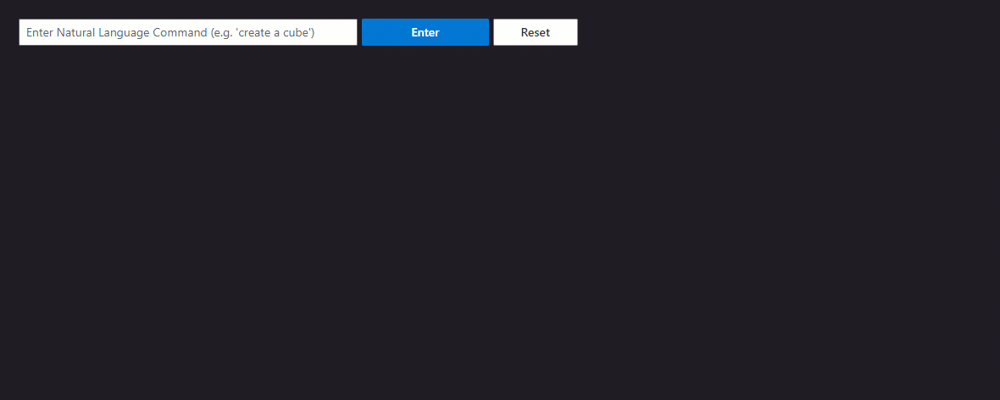

# Babylex

This project converts natural language into 3D assets using [BabylonJS](https://www.babylonjs.com/) and OpenAI's [Codex](https://openai.com/blog/openai-codex/):

The project is made up of a React web application frontend with an [Express](https://expressjs.com/) backend.

## Requirements

- Node.JS
- Open AI API Key to make API calls against Codex

## Running the App

1. `git clone` the repo: `git clone https://github.com/microsoft/Babylex` and open the Babylex folder
2. Create a `.env` file in the root directory of the project, copying the contents of the `.env.example` file
   1. The endpoint for OpenAI models is **https://api.openai.com/v1/completions**
   2. The model name can be from a list of available off-the-shelf engines or a fine-tuned model. See the [OpenAI API Reference](https://beta.openai.com/docs/api-reference/) for how to get a list of available models and fine-tunes from OpenAI.
3. Add the Open AI API Key and the port you want to run the app to the .env file.
4. Run `npm install` to gather the projects' dependencies
5. Run `npm run start` to serve the backend and launch the web application.

## Using the App

The app consists of a basic text box to enter natural language commands, and a 3D scene to display the results. Enter commands into the text box and press enter to see the results. Note that conversation context is maintained between commands, so subsequent commands can refer back to previous ones.

Example commands:

  > _Create a cube_

  > _Make it red and make it spin_

  >_Put a teal sphere above it and another below it_

  > _Make the bottom sphere change colors when the cursor hovers over it_

## Debugging
To debug the web application, you can [debug with VSCode debugger](https://code.visualstudio.com/Docs/editor/debugging).

To debug the code generated from codex, the current debugging experience is basic:
 - Observe logs in your browser dev tools (F12) to debug issues evaluating generated code
 - Observe logs in your console to debug issues between the Express server, Codex and the client

## Understand the Code
The server and client code is under `src/`.
### Client (src/client)
- `index.tsx` is the entry to bootstrap the React web application.
- `index.html` is the barebones main view of the app. It uses Bootstrap for basic styling

### Server (src/server)
- `app.ts` is the main entry point for the app. It sets up the Express to serve RESTful APIs after being transpile into JavaScript (output: `dist\server\app.js`).
- `model.ts` manages interaction the Codex API. This uses `isomorphic-fetch` to make POST calls of natural language to be converted to code. It also includes helper methods for engineering the prompt that is sent to Codex (see "prompt engineering" below)

## Prompt Engineering

Generative models like Codex are trained on the simple task of guessing the next token in a sequence. A good practice to coax the kind of tokens (code) you want from Codex is to include example interactions in a prompt - this practice is called few-shot prompt engineering. These examples are sent to the model with every API call, along with your natural language query. Codex then "guesses" the next tokens in the sequence (the code that satisfies the natural language).

This project currently contains multiple "contexts" - examples of what we expect from the model in the `contexts` folder. It also includes a `Context` class (see `Context.ts`) that offers several helpers for loading contexts and creating prompts. The contexts are currently modelled to represent a series of commands and the code that they generate. We define a prompt as a context plus a command, and this is what we pass to the model on each turn.

As a user interacts with the experience, we update the context to include past commands and responses. On subsequent conversation turns, this gives the model the relevant context to do things like pronoun resolution (e.g. of "it" in "make it red").

Currently a single ongoing context is maintained on the server. This can be reset with the "Reset" button in the app. The single context means that the app is currently not multi-tenanted, and that multiple browser instances will reuse the same context.

## Contributing

This project welcomes contributions and suggestions.  Most contributions require you to agree to a
Contributor License Agreement (CLA) declaring that you have the right to, and actually do, grant us
the rights to use your contribution. For details, visit https://cla.opensource.microsoft.com.

When you submit a pull request, a CLA bot will automatically determine whether you need to provide
a CLA and decorate the PR appropriately (e.g., status check, comment). Simply follow the instructions
provided by the bot. You will only need to do this once across all repos using our CLA.

This project has adopted the [Microsoft Open Source Code of Conduct](https://opensource.microsoft.com/codeofconduct/).
For more information see the [Code of Conduct FAQ](https://opensource.microsoft.com/codeofconduct/faq/) or
contact [opencode@microsoft.com](mailto:opencode@microsoft.com) with any additional questions or comments.

## Trademarks

This project may contain trademarks or logos for projects, products, or services. Authorized use of Microsoft
trademarks or logos is subject to and must follow
[Microsoft's Trademark & Brand Guidelines](https://www.microsoft.com/en-us/legal/intellectualproperty/trademarks/usage/general).
Use of Microsoft trademarks or logos in modified versions of this project must not cause confusion or imply Microsoft sponsorship.
Any use of third-party trademarks or logos are subject to those third-party's policies.
